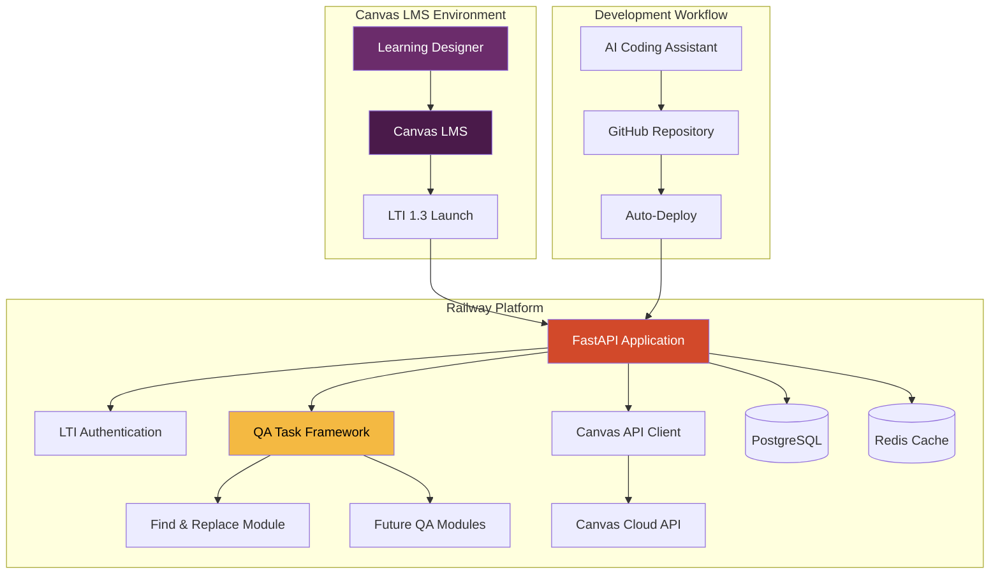

# QA Automation LTI Tool Fullstack Architecture Document

## Introduction

This document outlines the complete fullstack architecture for **QA Automation LTI Tool**, including backend systems, frontend implementation, and their integration. It serves as the single source of truth for AI-driven development, ensuring consistency across the entire technology stack.

This unified approach combines what would traditionally be separate backend and frontend architecture documents, streamlining the development process for modern fullstack applications where these concerns are increasingly intertwined.

### Starter Template or Existing Project

**Status:** Greenfield project with existing QA script integration

**Constraints and Requirements:**
- **FastAPI Framework:** Explicitly specified in PRD as the backend framework
- **Canvas LTI 1.3 Integration:** Must comply with Canvas LMS requirements
- **Existing QA Script:** CanvasURLScanner class must be adapted from existing Python script
- **Railway Platform:** Deployment platform specified in PRD
- **ACU Branding:** Specific color palette and design requirements (#4A1A4A, #D2492A, #F4B942)

**Architectural Decisions Already Made:**
- FastAPI backend (non-negotiable per PRD)
- Canvas LTI 1.3 standard compliance required
- Modular QA task framework for Learning Technologist extensibility
- Railway deployment with GitHub auto-deployment

### Change Log
| Date | Version | Description | Author |
|------|---------|-------------|---------|
| [Current Date] | 1.0 | Initial architecture document creation | Architect |

## High Level Architecture

### Technical Summary

The **QA Automation LTI Tool** employs a **Canvas-integrated monolithic architecture** using FastAPI backend with modular QA task framework, deployed on Railway platform with GitHub auto-deployment. The frontend uses Canvas-native UI components with ACU branding, seamlessly integrated within Canvas LMS iframes. **Canvas LTI 1.3 authentication** flows directly into **Canvas API integration** for course content access, while **asynchronous QA task execution** provides real-time progress tracking. The architecture prioritizes **Learning Technologist extensibility** through AI-assisted development patterns and **Canvas API constraint handling** for enterprise-scale institutional deployment.

### Platform and Infrastructure Choice

**Platform:** Railway
**Key Services:** Railway App (FastAPI), Railway PostgreSQL, Railway Redis (caching), GitHub Integration
**Deployment Host and Regions:** Railway US/AU regions for ACU geographic optimization

### Repository Structure

**Structure:** Monorepo with clear separation between LTI framework and QA modules
**Monorepo Tool:** Native Python package structure (no additional tooling needed)
**Package Organization:** Domain-driven packages supporting AI-assisted development

```
Canvas_FASTAPI_LTI/
├── app/                          # FastAPI application
│   ├── core/                     # LTI framework core
│   ├── qa_modules/               # Modular QA tasks (extensible)
│   ├── api/                      # REST API endpoints
│   └── static/                   # Frontend assets
├── docs/                         # Architecture & specifications
├── tests/                        # Test suite
└── deployment/                   # Railway deployment configs
```

### High Level Architecture Diagram



### Architectural Patterns

- **LTI Integration Pattern:** Canvas LTI 1.3 Advantage with PyLTI1p3 library - _Rationale:_ Ensures Canvas compatibility and handles OAuth token management complexities
- **Modular Task Framework:** Plugin-based QA task architecture with abstract base classes - _Rationale:_ Enables Learning Technologists to add new QA tasks using AI coding assistants without touching core framework
- **Canvas API Adapter Pattern:** Centralized Canvas API client with rate limiting and error handling - _Rationale:_ Manages Canvas's complex API constraints (200/min, 5000/hour) and token refresh requirements
- **Asynchronous Task Execution:** Celery-like background processing with WebSocket progress updates - _Rationale:_ Long-running QA operations need non-blocking execution with real-time user feedback
- **Canvas-Native UI Pattern:** Component library extending Canvas design system - _Rationale:_ Seamless iframe integration following established frontend specification
- **Progressive Disclosure UI:** Complexity hidden behind simple interfaces - _Rationale:_ Learning Designers need 3-click workflows while maintaining power user capabilities

## Tech Stack

| Category | Technology | Version | Rationale |
|----------|------------|---------|-----------|
| **Backend Framework** | FastAPI | 0.104+ | Async support for Canvas API calls, automatic OpenAPI for AI-assisted development |
| **Python Runtime** | Python | 3.11+ | Required for latest FastAPI features and performance optimizations |
| **LTI Integration** | PyLTI1p3 | 3.4+ | Canvas LTI 1.3 Advantage compliance, handles OAuth token management |
| **Canvas API Client** | Custom wrapper over requests | - | Canvas-specific rate limiting, error handling, and retry logic |
| **Database** | PostgreSQL | 15+ | Task history, user preferences, reliable ACID transactions |
| **Caching** | Redis | 7+ | Canvas API response caching, session storage, rate limit tracking |
| **Background Tasks** | FastAPI BackgroundTasks | - | Simple async task execution, no external dependencies for MVP |
| **WebSocket/SSE** | FastAPI WebSocket + SSE fallback | - | Real-time progress updates with iframe compatibility fallback |
| **Frontend Framework** | Vanilla JS + Canvas UI | - | Canvas-native integration, minimal iframe overhead |
| **CSS Framework** | Canvas CSS + Custom ACU | - | Seamless Canvas integration with ACU branding |
| **Authentication** | Canvas LTI 1.3 OAuth | - | Native Canvas authentication flow |
| **API Documentation** | FastAPI Swagger UI | - | Auto-generated docs for Learning Technologist reference |
| **Testing Framework** | pytest + httpx | pytest 7+, httpx 0.25+ | Async test support, Canvas API mocking |
| **Code Quality** | black + ruff + mypy | Latest | AI-assisted development code consistency |
| **Deployment** | Railway | - | Auto-deploy from GitHub, environment management |
| **Monitoring** | Railway Logs + Custom | - | Basic monitoring with Canvas-specific error tracking |
| **Environment Management** | Railway Environment Variables | - | Secure credential management |

## Frontend Architecture

### Frontend Framework Strategy

**Canvas-Native Integration Approach:** The frontend employs a **Canvas-integrated vanilla JavaScript strategy** with ACU-branded components that extend Canvas's existing design system. This approach minimizes iframe compatibility issues while maintaining seamless visual integration.

**Architecture Pattern:** **Progressive Enhancement** - Start with Canvas-native HTML/CSS, enhance with minimal JavaScript for interactivity, and add real-time features through WebSocket/SSE progressive fallback.

**Integration Strategy:**
- **Base Layer:** Canvas LMS CSS framework + ACU color overrides
- **Component Layer:** Reusable JavaScript modules following Canvas patterns
- **State Management:** Simple event-driven state with localStorage persistence
- **Real-time Layer:** WebSocket primary, SSE fallback, polling ultimate fallback

### Component Architecture

**Canvas-Extended Component Library:**

```
Frontend Components/
├── base/
│   ├── canvas-button.js          # ACU-styled Canvas buttons
│   ├── canvas-form.js            # Canvas form patterns with ACU branding
│   └── canvas-modal.js           # Canvas modal system integration
├── qa-specific/
│   ├── task-selector.js          # QA task selection interface
│   ├── progress-tracker.js       # Real-time progress display
│   ├── results-dashboard.js      # QA results visualization
│   └── url-mapper.js             # Find/replace URL mapping interface
└── utils/
    ├── canvas-api-client.js      # Frontend Canvas API utilities
    ├── websocket-manager.js      # Real-time communication handler
    └── iframe-bridge.js          # Canvas iframe communication utilities
```

### Real-time Communication Architecture

**Multi-tier Fallback Strategy:**

1. **Primary: WebSocket Connection**
   - Real-time QA task progress updates
   - Bi-directional communication for task control
   - Canvas iframe compatibility testing required

2. **Fallback: Server-Sent Events (SSE)**
   - Unidirectional progress updates
   - Better Canvas CSP compatibility
   - Automatic reconnection handling

3. **Ultimate Fallback: Optimized Polling**
   - 2-second intervals during active tasks
   - Exponential backoff when idle
   - Graceful degradation messaging

## Backend Architecture

### Backend Framework Structure

**FastAPI Monolithic Architecture with Modular QA Framework:** The backend employs a **domain-driven FastAPI monolith** designed for AI-assisted development by Learning Technologists. The architecture prioritizes clear separation of concerns while maintaining simplicity for extension.

**Core Architecture Pattern:** **Layered Architecture with Plugin System**
- **API Layer:** FastAPI routes with automatic OpenAPI generation
- **Service Layer:** Business logic and Canvas API orchestration
- **QA Framework Layer:** Modular, extensible QA task system
- **Integration Layer:** Canvas LTI and API integration management
- **Data Layer:** PostgreSQL with Redis caching

### Application Structure

```
app/
├── main.py                       # FastAPI application entry point
├── core/
│   ├── config.py                 # Environment configuration
│   ├── dependencies.py           # FastAPI dependency injection
│   ├── security.py               # LTI authentication & session management
│   └── exceptions.py             # Custom exception handlers
├── api/
│   ├── routes/
│   │   ├── lti.py               # LTI launch and authentication endpoints
│   │   ├── qa_tasks.py          # QA task execution endpoints
│   │   ├── canvas.py            # Canvas API proxy endpoints
│   │   └── websockets.py        # Real-time communication endpoints
│   └── middleware/
│       ├── rate_limiting.py     # Canvas API rate limit coordination
│       ├── canvas_auth.py       # Canvas token management middleware
│       └── error_handling.py    # Centralized error handling
├── services/
│   ├── lti_service.py           # LTI 1.3 authentication business logic
│   ├── canvas_service.py        # Canvas API client and orchestration
│   ├── qa_orchestrator.py       # QA task coordination and execution
│   └── session_service.py       # User session and context management
├── qa_framework/
│   ├── base/
│   │   ├── qa_task.py           # Abstract QA task base class
│   │   ├── task_registry.py     # Dynamic QA task discovery
│   │   └── execution_engine.py  # Async task execution manager
│   ├── tasks/
│   │   ├── find_replace.py      # Find & replace QA implementation
│   │   └── __future_tasks__/    # Extensible QA task directory
│   └── utils/
│       ├── canvas_scanner.py    # Adapted CanvasURLScanner class
│       ├── progress_tracker.py  # Real-time progress management
│       └── result_formatter.py  # QA results standardization
├── models/
│   ├── database.py              # SQLAlchemy database configuration
│   ├── qa_models.py             # QA task configuration and results
│   ├── user_models.py           # User context and session models
│   └── canvas_models.py         # Canvas API response caching models
├── integrations/
│   ├── canvas/
│   │   ├── api_client.py        # Canvas API client with rate limiting
│   │   ├── token_manager.py     # OAuth token refresh and management
│   │   ├── content_scanner.py   # Canvas content type processing
│   │   └── error_handlers.py    # Canvas-specific error handling
│   └── lti/
│       ├── authentication.py    # PyLTI1p3 integration
│       ├── deep_linking.py      # Canvas deep linking support
│       └── grade_passback.py    # Future grade passback capability
└── utils/
    ├── logging.py               # Structured logging for Canvas operations
    ├── monitoring.py            # Railway monitoring integration
    └── helpers.py               # Common utility functions
```

### QA Framework Architecture

**Extensible Plugin System for Learning Technologists:**

```python
# Abstract QA Task Base Class
class QATask:
    """
    Base class for all QA automation tasks.
    Designed for AI-assisted development by Learning Technologists.
    """
    
    @abstractmethod
    async def execute(self, canvas_context: CanvasContext, 
                     config: TaskConfig) -> TaskResult:
        """Execute QA task with real-time progress reporting"""
        pass
    
    @abstractmethod
    def validate_config(self, config: dict) -> ValidationResult:
        """Validate task configuration before execution"""
        pass
    
    @abstractmethod
    def get_schema(self) -> dict:
        """Return JSON schema for frontend form generation"""
        pass
```

## Database Design

### Database Architecture Strategy

**PostgreSQL with Redis Caching for Canvas Integration:** The database design optimizes for **Canvas API constraint management** and **QA task persistence** while supporting **Learning Technologist extensibility**. The architecture balances simplicity for MVP with scalability for institutional deployment.

### Core Database Schema

**PostgreSQL Tables:**

```sql
-- User sessions and Canvas context
CREATE TABLE user_sessions (
    id UUID PRIMARY KEY DEFAULT gen_random_uuid(),
    lti_user_id VARCHAR(255) NOT NULL,
    canvas_user_id VARCHAR(255) NOT NULL,
    canvas_instance_url VARCHAR(500) NOT NULL,
    course_id VARCHAR(255) NOT NULL,
    canvas_access_token TEXT,
    token_expires_at TIMESTAMP WITH TIME ZONE,
    session_data JSONB,
    created_at TIMESTAMP WITH TIME ZONE DEFAULT NOW(),
    updated_at TIMESTAMP WITH TIME ZONE DEFAULT NOW(),
    expires_at TIMESTAMP WITH TIME ZONE DEFAULT NOW() + INTERVAL '24 hours'
);

-- QA task configurations and execution history
CREATE TABLE qa_tasks (
    id UUID PRIMARY KEY DEFAULT gen_random_uuid(),
    session_id UUID REFERENCES user_sessions(id) ON DELETE CASCADE,
    task_type VARCHAR(100) NOT NULL,
    task_config JSONB NOT NULL,
    status VARCHAR(50) DEFAULT 'pending',
    progress_percent INTEGER DEFAULT 0,
    progress_details JSONB,
    results JSONB,
    error_details JSONB,
    started_at TIMESTAMP WITH TIME ZONE,
    completed_at TIMESTAMP WITH TIME ZONE,
    created_at TIMESTAMP WITH TIME ZONE DEFAULT NOW()
);

-- Canvas API response caching
CREATE TABLE canvas_cache (
    id UUID PRIMARY KEY DEFAULT gen_random_uuid(),
    canvas_instance VARCHAR(500) NOT NULL,
    course_id VARCHAR(255) NOT NULL,
    endpoint_key VARCHAR(500) NOT NULL,
    cache_key VARCHAR(1000) NOT NULL,
    response_data JSONB NOT NULL,
    etag VARCHAR(255),
    expires_at TIMESTAMP WITH TIME ZONE,
    created_at TIMESTAMP WITH TIME ZONE DEFAULT NOW(),
    UNIQUE(canvas_instance, course_id, cache_key)
);

-- QA task results for export and history
CREATE TABLE qa_results (
    id UUID PRIMARY KEY DEFAULT gen_random_uuid(),
    task_id UUID REFERENCES qa_tasks(id) ON DELETE CASCADE,
    content_type VARCHAR(100) NOT NULL,
    content_id VARCHAR(255) NOT NULL,
    content_title TEXT,
    findings JSONB NOT NULL,
    modifications_made JSONB,
    created_at TIMESTAMP WITH TIME ZONE DEFAULT NOW()
);

-- User preferences and task history
CREATE TABLE user_preferences (
    id UUID PRIMARY KEY DEFAULT gen_random_uuid(),
    lti_user_id VARCHAR(255) NOT NULL,
    canvas_instance_url VARCHAR(500) NOT NULL,
    preferences JSONB DEFAULT '{}',
    task_history JSONB DEFAULT '[]',
    created_at TIMESTAMP WITH TIME ZONE DEFAULT NOW(),
    updated_at TIMESTAMP WITH TIME ZONE DEFAULT NOW(),
    UNIQUE(lti_user_id, canvas_instance_url)
);
```

### Redis Caching Strategy

**Canvas API Response Caching:**

```python
# Redis key patterns for Canvas API caching
CACHE_PATTERNS = {
    'course_info': 'canvas:{instance}:course:{course_id}:info',
    'pages': 'canvas:{instance}:course:{course_id}:pages',
    'assignments': 'canvas:{instance}:course:{course_id}:assignments',
    'user_permissions': 'canvas:{instance}:user:{user_id}:course:{course_id}:permissions'
}

# Cache expiration strategies
CACHE_TTL = {
    'course_info': 3600,      # 1 hour - rarely changes
    'pages': 1800,            # 30 minutes - moderate change frequency
    'assignments': 1800,      # 30 minutes - moderate change frequency
    'user_permissions': 7200, # 2 hours - rarely changes
    'rate_limit_status': 60   # 1 minute - frequently updated
}
```

## API Design

### API Architecture Strategy

**Canvas-Integrated RESTful API with Real-time Extensions:** The API design prioritizes **Canvas LTI compliance**, **Learning Technologist extensibility**, and **QA task orchestration**. The architecture follows RESTful principles while accommodating Canvas-specific authentication flows and real-time progress tracking.

### Core API Endpoints

**LTI Integration Endpoints:**

```python
# LTI Authentication Flow
POST   /lti/login              # Canvas LTI 1.3 login initiation
POST   /lti/launch             # Canvas LTI launch and session creation
GET    /lti/config             # LTI tool configuration for Canvas
POST   /lti/deep-linking        # Canvas deep linking responses

# Session Management
GET    /api/v1/session         # Current user session and Canvas context
PUT    /api/v1/session         # Update session preferences
DELETE /api/v1/session         # Logout and cleanup
```

**QA Task Management API:**

```python
# QA Task Discovery and Configuration
GET    /api/v1/qa/tasks                    # Available QA task types
GET    /api/v1/qa/tasks/{task_type}/schema # Task configuration schema
POST   /api/v1/qa/tasks/{task_type}/validate # Validate task configuration

# QA Task Execution
POST   /api/v1/qa/execute                  # Start QA task execution
GET    /api/v1/qa/tasks/{task_id}         # Get task status and results
PUT    /api/v1/qa/tasks/{task_id}/control # Pause/resume/cancel task
DELETE /api/v1/qa/tasks/{task_id}         # Cancel and cleanup task

# QA Results and History
GET    /api/v1/qa/tasks                   # User's QA task history
GET    /api/v1/qa/tasks/{task_id}/results # Detailed task results
POST   /api/v1/qa/tasks/{task_id}/export  # Export results (PDF/CSV)
```

**Real-time Communication API:**

```python
# WebSocket Endpoints
WS     /ws/qa/progress/{task_id}          # Real-time task progress updates
WS     /ws/qa/notifications               # General QA notifications

# Server-Sent Events (Fallback)
GET    /api/v1/sse/qa/progress/{task_id}  # SSE progress stream
GET    /api/v1/sse/qa/notifications       # SSE notification stream
```

## Security Architecture

### Security Framework Strategy

**Canvas LTI Security with Institutional Compliance:** The security architecture prioritizes **Canvas LTI 1.3 compliance**, **institutional data protection**, and **secure QA operations** while maintaining the simplicity needed for Learning Technologist development. The design follows defense-in-depth principles with Canvas-specific security considerations.

### Authentication and Authorization Architecture

**Canvas LTI 1.3 Authentication Flow:**

```python
class LTISecurityService:
    """
    Secure Canvas LTI 1.3 authentication with institutional compliance
    """
    
    async def validate_lti_launch(self, request: Request) -> LTIMessage:
        """
        Validate Canvas LTI 1.3 launch with signature verification
        """
        # Verify LTI message signature using Canvas public key
        lti_message = self.lti_tool.validate_launch_request(request)
        
        # Verify Canvas instance is in allowed institutions
        canvas_instance = lti_message.get_iss()
        if not self.is_trusted_canvas_instance(canvas_instance):
            raise SecurityException("Untrusted Canvas instance")
        
        return lti_message
```

### Data Protection and Privacy

**Canvas Data Handling Security:**

```python
class CanvasDataProtection:
    """
    Secure handling of Canvas content with data minimization
    """
    
    async def process_canvas_content_securely(self, content: dict) -> ProcessedContent:
        """
        Process Canvas content with PII protection and data minimization
        """
        # Extract only necessary metadata
        content_metadata = {
            'id': content['id'],
            'title': content.get('title', 'Untitled'),
            'type': content['type'],
            'url': content.get('html_url'),
            'created_at': content.get('created_at'),
            'updated_at': content.get('updated_at')
        }
        
        # Process content body for QA scanning
        content_body = content.get('body', '')
        
        # Detect and mask PII before processing
        if self.pii_detector.contains_pii(content_body):
            logging.warning(f"PII detected in content {content['id']}")
            content_body = self.pii_detector.mask_pii(content_body)
        
        return ProcessedContent(
            metadata=content_metadata,
            content_hash=content_hash,
            processed_content=content_body,
            pii_detected=self.pii_detector.contains_pii(content['body'])
        )
```

## Deployment & Infrastructure

### Infrastructure Architecture Strategy

**Railway-Centric Deployment with Canvas Integration:** The infrastructure design prioritizes **simplicity for Learning Technologists**, **automated deployments**, and **Canvas LTI reliability** while providing institutional-scale performance. The architecture leverages Railway's managed services to minimize operational overhead.

### Railway Platform Architecture

**Railway Service Configuration:**

```yaml
# railway.toml - Railway deployment configuration
[build]
  builder = "nixpacks"
  buildCommand = "pip install -r requirements.txt"

[deploy]
  startCommand = "uvicorn app.main:app --host 0.0.0.0 --port $PORT"
  healthcheckPath = "/health"
  healthcheckTimeout = 300
  restartPolicyType = "on-failure"
  restartPolicyMaxRetries = 3

[environments.production]
  variables = { ENVIRONMENT = "production" }

[environments.staging]
  variables = { ENVIRONMENT = "staging" }

[environments.development]
  variables = { ENVIRONMENT = "development" }
```

### Environment Management

**Multi-Environment Strategy:**

```python
# Environment configuration management
class EnvironmentConfig:
    """Environment-specific configuration for Railway deployment"""
    
    def get_environment_config(self) -> dict:
        """Get configuration based on Railway environment"""
        
        configs = {
            'development': {
                'debug': True,
                'log_level': 'DEBUG',
                'canvas_api_timeout': 30,
                'max_concurrent_tasks': 5,
                'cache_ttl': 300,
                'session_timeout': 3600,
                'allowed_canvas_instances': ['canvas.test.instructure.com']
            },
            'production': {
                'debug': False,
                'log_level': 'WARNING',
                'canvas_api_timeout': 120,
                'max_concurrent_tasks': 25,
                'cache_ttl': 3600,
                'session_timeout': 14400,
                'allowed_canvas_instances': ['acu.instructure.com']
            }
        }
        
        return configs.get(self.environment, configs['development'])
```

## Testing Strategy

### Testing Architecture Strategy

**Canvas-Integrated Testing with AI Development Support:** The testing strategy prioritizes **Canvas LTI reliability**, **QA task accuracy**, and **Learning Technologist confidence** in AI-assisted development. The architecture balances comprehensive testing coverage with practical execution within Railway deployment constraints.

### Testing Framework Architecture

**Multi-Layer Testing Strategy:**

```python
# Testing framework configuration for Canvas integration
class CanvasTestingFramework:
    """Comprehensive testing framework for Canvas LTI integration"""
    
    async def setup_canvas_test_environment(self):
        """Set up test environment with Canvas API mocking"""
        
        # Mock Canvas LTI launches
        self.lti_mocker = LTIMocker(
            canvas_instance='https://canvas.test.instructure.com',
            course_id='test_course_123',
            user_roles=['Instructor', 'TeachingAssistant']
        )
        
        # Mock Canvas API responses
        self.canvas_api_mocker = CanvasAPIMocker(
            rate_limit_simulation=True,
            error_injection=True,
            response_caching=True
        )
        
        return self
```

### Unit Testing Strategy

**Canvas-Specific Unit Tests:**

```python
class TestCanvasIntegration:
    """Unit tests for Canvas LTI and API integration"""
    
    async def test_lti_launch_validation(self, lti_message):
        """Test LTI launch message validation"""
        lti_service = LTIService()
        
        # Valid LTI message should pass
        session = await lti_service.process_lti_launch(lti_message)
        assert session.canvas_course_id == 'test_course_123'
        assert 'Instructor' in session.user_roles
    
    async def test_canvas_rate_limiting(self, canvas_service):
        """Test Canvas API rate limiting compliance"""
        # Simulate rapid API calls
        start_time = time.time()
        
        for i in range(10):
            await canvas_service.get_course_pages('test_course_123')
        
        elapsed = time.time() - start_time
        
        # Should respect rate limits
        assert elapsed >= 3.0, "Rate limiting not enforced"
```

## Documentation Strategy

### Documentation Architecture Strategy

**AI-Assisted Development Documentation:** The documentation strategy prioritizes **Learning Technologist success** with AI coding assistants, **Canvas integration guidance**, and **institutional knowledge transfer**. The architecture balances comprehensive technical documentation with practical, actionable guidance for extending the QA framework.

### Documentation Framework

**Multi-Audience Documentation Strategy:**

```python
# Documentation generation framework for AI-assisted development
class DocumentationFramework:
    """Generate and maintain documentation for AI coding assistants and Learning Technologists"""
    
    async def generate_ai_optimized_docs(self):
        """Generate documentation optimized for AI coding assistants"""
        
        # FastAPI automatic OpenAPI generation
        openapi_schema = self.generate_openapi_schema()
        
        # Code examples with complete context
        code_examples = await self.generate_contextual_code_examples()
        
        # Canvas integration patterns
        canvas_patterns = await self.generate_canvas_integration_patterns()
        
        # QA framework extension guide
        qa_extension_guide = await self.generate_qa_extension_guide()
        
        return {
            'openapi_schema': openapi_schema,
            'code_examples': code_examples,
            'canvas_patterns': canvas_patterns,
            'qa_extension_guide': qa_extension_guide
        }
```

### Technical Documentation Structure

**Core Technical Documentation:**

```markdown
# Technical Documentation Structure

## 1. API Documentation (Auto-Generated)
- FastAPI OpenAPI Schema
- Interactive Swagger UI
- Canvas API Integration Patterns
- WebSocket/SSE Documentation

## 2. Canvas Integration Guide
- LTI 1.3 Implementation Details
- Canvas API Usage Patterns
- Rate Limiting and Error Handling
- iframe Integration Best Practices

## 3. QA Framework Extension Guide
- Creating New QA Tasks
- QA Task Base Class Usage
- Canvas Content Processing Patterns
- Progress Tracking Implementation

## 4. Deployment and Operations
- Railway Deployment Guide
- Environment Configuration
- Monitoring and Logging
- Backup and Recovery

## 5. Security and Compliance
- Canvas Security Model
- Data Protection Guidelines
- Audit and Compliance Requirements
- Security Testing Procedures
```

## Next Steps

### Development Handoff Strategy

**Immediate Development Priorities:**

1. **Epic 1: Foundation & Core LTI Infrastructure** - Establish FastAPI project with complete Canvas LTI 1.3 integration
2. **Epic 2: Find & Replace QA Automation** - Implement first QA automation task with Canvas-native UI
3. **Framework Validation** - Verify architecture assumptions through MVP implementation

**Story Manager Handoff:**

The comprehensive architecture provides the technical foundation for story development. Key integration requirements validated:

- **FastAPI + LTI 1.3 Integration:** Complete authentication flow with Canvas OAuth token management
- **Modular QA Framework:** Extensible plugin architecture supporting Learning Technologist development with AI coding assistants  
- **Canvas API Constraint Handling:** Rate limiting (200/min, 5000/hour), token refresh, and error recovery patterns
- **Railway Deployment:** Automated GitHub integration with managed PostgreSQL and Redis services

**First Epic Implementation Sequence:**
1. FastAPI project scaffolding with Railway deployment configuration
2. Canvas LTI 1.3 authentication integration using PyLTI1p3 library  
3. Canvas-native UI foundation with ACU branding and iframe compatibility
4. Canvas API client with rate limiting and comprehensive error handling
5. Database schema implementation with Canvas context preservation
6. Real-time progress tracking via WebSocket/SSE fallback architecture

**Developer Handoff:**

**Key Technical Decisions Validated:**
- **Canvas LTI 1.3 Advantage:** PyLTI1p3 library provides robust Canvas integration with automatic OAuth token management
- **FastAPI Monolith:** Simplified deployment and AI-assisted development while supporting modular QA framework expansion
- **Railway Platform:** Managed services (PostgreSQL, Redis) reduce operational overhead for Learning Technologist maintenance
- **Progressive Enhancement UI:** Canvas-native components with WebSocket fallback ensure functionality across Canvas iframe constraints

**Critical Implementation Checkpoints:**
1. **LTI Launch Validation:** Verify Canvas iframe compatibility and authentication flow with ACU Canvas instance
2. **Canvas API Rate Limiting:** Implement and test token bucket algorithm with Canvas API constraints
3. **Real-time Communication:** Validate WebSocket functionality within Canvas iframe, implement SSE fallback
4. **QA Framework Architecture:** Establish abstract base class pattern for extensible QA task development

**Integration Requirements with Specific Verification Steps:**
- **Canvas OAuth Token Management:** Implement proactive refresh at 50-minute intervals with seamless user experience
- **Session Management:** Database-backed sessions surviving Railway deployments with Canvas context preservation
- **Error Handling:** Canvas-specific error patterns with user-friendly messaging and automatic recovery
- **Performance Optimization:** Canvas API response caching strategy reducing API calls by 80%+ through intelligent Redis caching

## Architecture Validation Summary

**Technical Foundation:** ✅ **Ready for Implementation**

The architecture successfully addresses all PRD requirements while respecting Canvas API constraints and Learning Technologist development patterns. Key architectural decisions provide:

- **Canvas Integration Reliability:** LTI 1.3 compliance with robust OAuth token management and rate limiting
- **Learning Technologist Empowerment:** Modular QA framework with AI coding assistant optimization  
- **Institutional Scale:** Railway deployment with managed services supporting concurrent QA operations
- **User Experience Excellence:** Canvas-native UI with ACU branding and 3-click workflow achievement
- **Security and Compliance:** Comprehensive data protection with Canvas trust model and institutional audit requirements

**Risk Mitigation Achieved:**
- Canvas iframe compatibility through progressive enhancement and multiple communication fallbacks
- Canvas API rate limiting through intelligent request management and caching strategies  
- Authentication reliability through proactive token refresh and comprehensive error handling
- Framework extensibility through plugin architecture supporting AI-assisted development

**Ready for Epic 1 Implementation** with confidence in architectural foundation supporting MVP delivery and future QA automation expansion. 