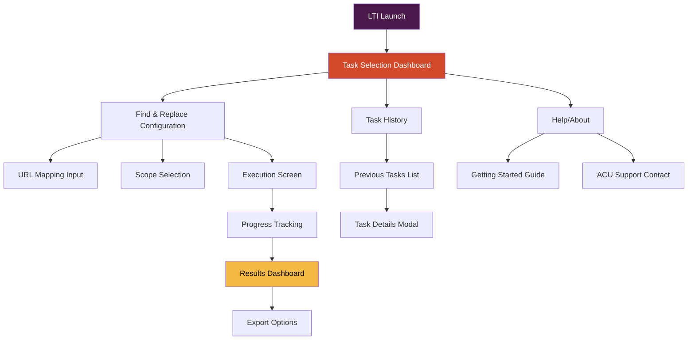
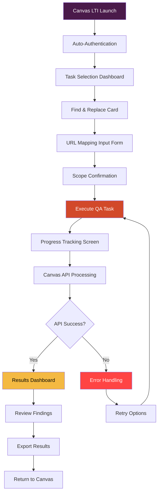

# QA Automation LTI Tool UI/UX Specification

## Introduction

This document defines the user experience goals, information architecture, user flows, and visual design specifications for **QA Automation LTI Tool**'s user interface. It serves as the foundation for visual design and frontend development, ensuring a cohesive and user-centered experience that feels native within Canvas LMS.

**Document Purpose & Scope:**
- Design Canvas-integrated LTI interface following ACU branding
- Enable 3-click QA task completion for Learning Designers
- Establish progressive disclosure patterns for complex automation
- Ensure WCAG AA accessibility compliance within Canvas constraints

### Overall UX Goals & Principles

#### Target User Personas

**Primary: Learning Designer (Emma)**
- Non-technical education professional focused on course quality
- Works primarily within Canvas LMS environment
- Needs intuitive, error-proof interfaces
- Values time efficiency and clear visual feedback
- Occasionally uses QA tools but not daily power user

**Secondary: Learning Technologist (Alex)**
- Technical background with AI coding assistant experience
- Builds and extends LTI framework using Cursor/Claude
- Needs framework admin capabilities (future)
- Values clean, maintainable UI patterns

#### Usability Goals

1. **Immediate Competency**: Learning Designers complete find-and-replace QA task successfully on first attempt without training
2. **Speed Optimization**: 90% reduction in QA setup time (15 minutes terminal → 2 minutes LTI interface)
3. **Error Prevention**: Canvas iframe integration prevents navigation errors and maintains user context
4. **Memorability**: Infrequent users can return and complete tasks without relearning interface patterns
5. **Trust Building**: Visual progress feedback and clear results build confidence in automated QA processes

#### Design Principles

1. **Canvas-Native Integration** - Interface feels like natural Canvas extension, not external tool
2. **Progressive Disclosure** - Show only what's needed for current step, reveal complexity gradually  
3. **Immediate Visual Feedback** - Every action provides clear, immediate response with progress indicators
4. **ACU Brand Confidence** - Professional styling builds trust in QA automation capabilities
5. **Graceful Degradation** - Interface remains functional when Canvas API constraints apply

### Change Log
| Date | Version | Description | Author |
|------|---------|-------------|---------|
| [Current Date] | 1.0 | Initial UI/UX specification creation | UX Expert |

## Information Architecture (IA)

### Site Map / Screen Inventory

### Navigation Structure

**Primary Navigation:** Single-page interface with progressive disclosure - no traditional navigation menu to maximize iframe space

**Secondary Navigation:** Breadcrumb trail for multi-step processes (Configuration → Execution → Results)

**Breadcrumb Strategy:** Contextual progress indicator showing: Current Step → Canvas Course Context → Task Type

## User Flows

### Flow 1: Find & Replace QA Task Execution

**User Goal:** Complete URL find-and-replace QA scan with minimal effort and clear results

**Entry Points:** Canvas course → LTI tool launch → Task selection

**Success Criteria:** QA results viewed, actionable recommendations identified, optional export completed

#### Flow Diagram:

#### Edge Cases & Error Handling:
- **Canvas API Rate Limiting**: Progress indicator shows throttling status, estimated completion time
- **Session Timeout**: Keep-alive mechanism + progress preservation, graceful session extension
- **Large Course Content**: Chunked processing with interim progress updates
- **No Content Found**: Clear messaging with course context confirmation
- **Partial Failures**: Results show completed vs. failed sections with retry options

#### Notes: 
- **iframe Optimization**: All interactions contained within iframe, no external navigation
- **Progressive Disclosure**: Complex configurations hidden behind "Advanced Options" 
- **Canvas Integration**: Breadcrumbs maintain Canvas course context throughout flow

## Wireframes & Mockups

### Primary Design Files
**Primary Design Files:** Figma workspace with Canvas design system integration - [Canvas LTI Native Pattern Library]

### Key Screen Layouts

#### Screen 1: Task Selection Dashboard

**Purpose:** First interface after LTI launch, matches Canvas course homepage patterns

**Key Elements:**
- **Canvas Header Integration**: Breadcrumb follows Canvas navigation style (Course > Tools > QA Automation)
- **ACU-Canvas Color Fusion**: Primary headers use ACU Deep Purple (#4A1A4A) while maintaining Canvas typography (LatoWeb)
- **Card-Based Layout**: QA task cards use Canvas's module item styling with ACU accent colors
- **Help Integration**: Canvas help system pattern with contextual QA automation guidance

**Interaction Notes:** 
- Hover states match Canvas module item interactions
- Click actions use Canvas's existing transition patterns
- Progress indicators follow Canvas course progress styling

#### Screen 2: Find & Replace Configuration

**Purpose:** URL mapping input following Canvas assignment creation patterns

**Key Elements:**
- **Canvas Form Styling**: Input fields match Canvas Rich Content Editor patterns
- **Progressive Disclosure**: "Advanced Options" collapses like Canvas assignment settings
- **Validation Patterns**: Real-time validation using Canvas form validation styling
- **ACU Branding**: Form labels use ACU Deep Purple, validation success uses ACU Gold (#F4B942)

**Interaction Notes:**
- URL mapping interface resembles Canvas external URL configuration
- Scope selection uses Canvas checkbox/radio button styling
- Preview functionality matches Canvas assignment preview patterns

#### Screen 3: Execution & Progress Tracking

**Purpose:** Real-time QA operation feedback using Canvas loading patterns

**Key Elements:**
- **Canvas Progress Bars**: Match Canvas course/module progress indicators
- **Skeleton Screens**: Canvas-styled loading states for API calls
- **Status Updates**: Canvas notification styling for progress messages
- **Keep-Alive Integration**: Transparent session management using Canvas session patterns

**Interaction Notes:**
- Cancel actions follow Canvas's destructive action confirmation patterns
- Background processing indicators match Canvas file upload progress
- Real-time updates use Canvas live region patterns for accessibility

#### Screen 4: Results Dashboard

**Purpose:** QA findings presentation using Canvas gradebook/analytics patterns

**Key Elements:**
- **Canvas Table Styling**: Results table matches Canvas gradebook appearance
- **Visual Hierarchy**: Uses Canvas's existing content organization patterns
- **Export Integration**: Canvas-styled download buttons with ACU Gold highlights
- **Actionable Insights**: Canvas alert styling for critical findings

**Interaction Notes:**
- Row expansion matches Canvas gradebook detail views
- Results filtering uses Canvas search/filter patterns
- Share functionality integrates with Canvas sharing mechanisms

## Component Library / Design System

### Design System Approach

**Design System Approach:** **Canvas-Native Component Extension** - We'll extend Canvas's existing design system with ACU-branded components rather than creating an entirely new system. This ensures seamless integration while maintaining ACU's visual identity within Canvas constraints.

### Core Components

#### Component 1: ACU-Canvas Button

**Purpose:** Primary action buttons that blend ACU branding with Canvas interaction patterns

**Variants:**
- **Primary**: ACU Red (#D2492A) background, Canvas button structure
- **Secondary**: Canvas button with ACU Purple (#4A1A4A) border  
- **Success**: ACU Gold (#F4B942) for completion actions
- **Danger**: Canvas red with ACU styling for destructive actions

**States:**
- Default: ACU brand colors with Canvas typography
- Hover: Canvas hover effects with ACU color transitions
- Active: Canvas active patterns with ACU feedback
- Disabled: Canvas disabled styling with ACU opacity

**Usage Guidelines:** Use primary for main QA actions (Execute, Export), secondary for navigation, success for completed tasks, danger for error recovery

#### Component 2: QA Progress Indicator

**Purpose:** Canvas-native progress tracking for long-running QA operations

**Variants:**
- **Linear Progress**: Canvas progress bar with ACU Purple fill
- **Circular Progress**: Canvas spinner with ACU color scheme
- **Step Progress**: Canvas breadcrumb styling with QA task steps
- **Status Badge**: Canvas alert styling with ACU status colors

**States:**
- Pending: Canvas gray with ACU light purple tint
- Active: ACU Purple (#4A1A4A) with Canvas animation
- Complete: ACU Gold (#F4B942) with Canvas success styling
- Error: Canvas red with ACU error patterns

**Usage Guidelines:** Always include estimated time remaining, Canvas-style cancel options, and session keep-alive integration

#### Component 3: Canvas-QA Data Table

**Purpose:** Results display following Canvas gradebook patterns with QA-specific enhancements

**Variants:**
- **Findings Table**: Canvas table styling with ACU accent highlights
- **URL Mapping Table**: Canvas form table with ACU input styling
- **History Table**: Canvas course table with ACU status indicators
- **Export Table**: Canvas data table with ACU download actions

**States:**
- Default: Canvas table with ACU header colors
- Sortable: Canvas sort indicators with ACU hover states
- Filtered: Canvas filter styling with ACU active states
- Selected: Canvas selection with ACU highlight colors

**Usage Guidelines:** Follow Canvas table accessibility patterns, maintain Canvas keyboard navigation, use ACU colors for data hierarchy

## Branding & Style Guide

### Visual Identity
**Brand Guidelines:** ACU Brand Guidelines integrated with Canvas LMS design system

### Color Palette

| Color Type | Hex Code | Usage |
|------------|----------|-------|
| Primary | #4A1A4A | Headers, primary actions, ACU brand emphasis |
| Background/Text | #6B2C6B | Main text and interface elements |
| ACU Red | #D2492A | Primary buttons, interactive elements |
| ACU Red Secondary | #B8391F | Button hover states, accents |
| Gold Primary | #F4B942 | Success states, highlights, secondary buttons |
| Gold Secondary | #E6A830 | Gold hover states, secondary highlights |
| Cream Light | #F9F4F1 | Content backgrounds, cards |
| Cream Secondary | #F4ECE6 | Secondary content backgrounds |

### Typography

#### Font Families
- **Primary:** LatoWeb (Canvas LMS standard)
- **Secondary:** Source Sans Pro (Canvas fallback)
- **Monospace:** Monaco, Consolas (Canvas code styling)

#### Type Scale

| Element | Size | Weight | Line Height |
|---------|------|--------|-------------|
| H1 | 24px | 600 | 1.3 |
| H2 | 20px | 600 | 1.4 |
| H3 | 18px | 600 | 1.4 |
| Body | 14px | 400 | 1.5 |
| Small | 12px | 400 | 1.4 |

### Iconography
**Icon Library:** Canvas LMS icon system + Feather icons for QA-specific actions

**Usage Guidelines:** Use Canvas icons for navigation and common actions, Feather icons for QA automation specific functions

### Spacing & Layout
**Grid System:** Canvas LMS 16px base grid system

**Spacing Scale:** 4px, 8px, 16px, 24px, 32px, 48px (Canvas standard)

## Accessibility Requirements

### Compliance Target
**Standard:** WCAG AA compliance with emphasis on color contrast ratios

### Key Requirements

**Visual:**
- Color contrast ratios: Minimum 4.5:1 for normal text, 3:1 for large text
- Focus indicators: Canvas-standard focus rings with ACU color enhancements
- Text sizing: Scalable text following Canvas responsive patterns

**Interaction:**
- Keyboard navigation: Full keyboard accessibility using Canvas navigation patterns
- Screen reader support: Proper ARIA labels and Canvas live region integration
- Touch targets: Minimum 44px touch targets for mobile Canvas usage

**Content:**
- Alternative text: Descriptive alt text for QA result visualizations
- Heading structure: Logical heading hierarchy following Canvas content patterns
- Form labels: Clear, descriptive labels for all QA configuration inputs

### Testing Strategy
Regular accessibility testing using Canvas's existing accessibility validation tools and manual keyboard navigation testing

## Responsiveness Strategy

### Breakpoints

| Breakpoint | Min Width | Max Width | Target Devices |
|------------|-----------|-----------|----------------|
| Mobile | 320px | 767px | Mobile Canvas app, small tablets |
| Tablet | 768px | 1023px | Canvas tablet interface |
| Desktop | 1024px | 1439px | Standard Canvas desktop |
| Wide | 1440px | - | Large Canvas desktop displays |

### Adaptation Patterns

**Layout Changes:** Single column on mobile, progressive disclosure enhanced for touch
**Navigation Changes:** Collapsible navigation following Canvas mobile patterns
**Content Priority:** QA results prioritized, secondary features collapsed on mobile
**Interaction Changes:** Touch-optimized controls, Canvas mobile gesture patterns

## Animation & Micro-interactions

### Motion Principles
**Subtle, purposeful motion** that enhances Canvas LMS experience without distraction. All animations respect user's motion preferences and Canvas accessibility settings.

### Key Animations
- **Progress Indication**: Smooth progress bar fills (Duration: 200ms, Easing: ease-out)
- **State Transitions**: Button state changes (Duration: 150ms, Easing: ease)
- **Modal Appearance**: Canvas-style modal slide-in (Duration: 300ms, Easing: ease-out)
- **Results Loading**: Skeleton screen transitions (Duration: 400ms, Easing: ease-in-out)

## Performance Considerations

### Performance Goals
- **Page Load:** Under 2 seconds for initial LTI launch
- **Interaction Response:** Under 100ms for UI feedback
- **Animation FPS:** 60fps for all animations

### Design Strategies
Leverage Canvas's existing CSS framework, minimize custom assets, optimize for Canvas's caching strategies, lazy load non-critical QA visualization components

## Next Steps

### Immediate Actions
1. Review UI/UX specification with ACU stakeholders
2. Validate Canvas LTI integration approach with Canvas administrators
3. Create detailed visual designs in Figma following this specification
4. Prepare for handoff to Architect for technical implementation planning

### Design Handoff Checklist
- [x] All user flows documented
- [x] Component inventory complete
- [x] Accessibility requirements defined
- [x] Responsive strategy clear
- [x] Brand guidelines incorporated
- [x] Performance goals established 